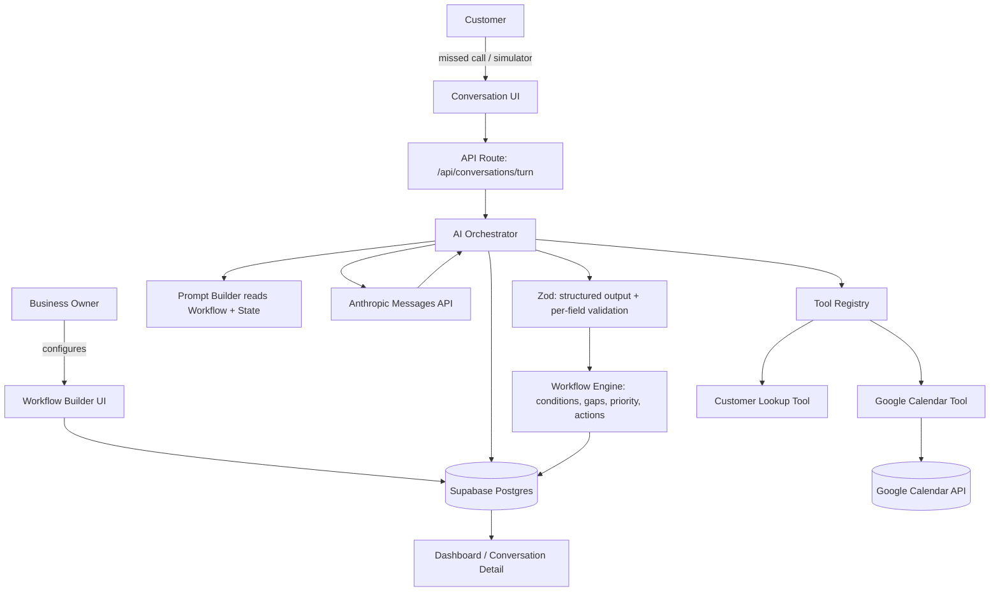
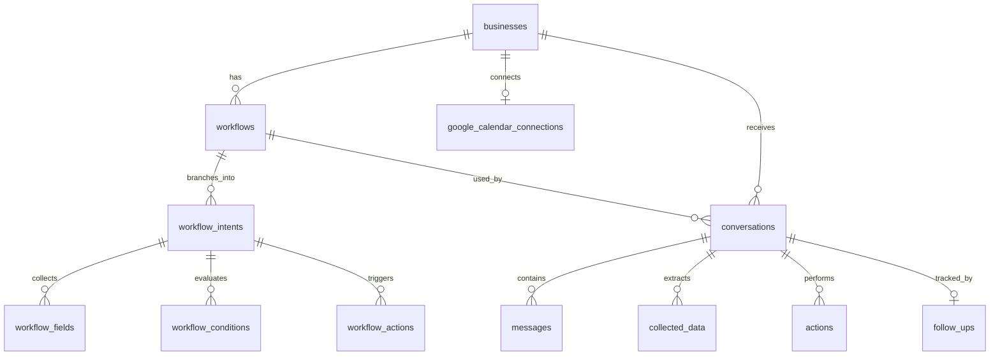

# Voice AI Missed-Call Assistant — Core Engine

A workflow-driven AI assistant for small businesses to handle missed calls:
capture what the customer needs, extract structured data, act on it (book a
calendar slot, flag urgency), and hand the owner a clean summary instead of a
missed call.

**Status of this repo:** this is the AI/workflow engine core, built and
reviewable as real code — not the full 72-hour product (see [Scope of this
delivery](#scope-of-this-delivery)). It is the part of the assignment where
shortcuts are easiest to hide and most damaging to take, so it's what's built
first and built for real.

---

## Scope of this delivery

| Layer | Status |
|---|---|
| Database schema (Postgres/Supabase, RLS) | Complete, real |
| Workflow engine (condition eval, field-gap detection, priority resolution, action resolution) | Complete, real, unit-tested |
| Zod validation (workflow builder input + structured AI output + per-field type checking) | Complete, real |
| AI orchestrator (context building, LLM call, schema validation, tool dispatch, state update) | Complete, real, calls the real Anthropic API |
| Service layer (`lib/services/workflows.ts`, `lib/services/conversations.ts`) — loads/persists domain objects from Postgres | Complete, real |
| API routes (`/api/conversations/turn`, `/api/workflows`, `/api/workflows/[id]`, `/api/integrations/google/connect`+`/callback`) | Complete, real Next.js route handlers |
| `notify_owner` completion action | Recorded honestly as `status: "pending"` with a stated reason — no email/SMS provider is wired up in this delivery, and it is never marked "success" without actually sending something |
| Demo seed data (SweetCrust Bakery + CarePoint Clinic, realistic completed/urgent/abandoned conversations) | Complete, real SQL — see `supabase/seed.sql` |
| Simulator UI (`/simulator`) — business/workflow picker, chat, live workflow-state panel with tool-event feed | Complete, real, calls the actual `/api/conversations/turn` endpoint end-to-end |
| Dashboard (`/dashboard`) — metrics + recent conversations table | Complete, real, server component reading directly from Postgres |
| Conversation detail (`/conversations/[id]`) — summary, structured fields, actions performed, transcript, follow-up status management | Complete, real, including a working `PATCH` to update follow-up status |
| Workflow builder (`/workflows/new`) — guided step-by-step form, posts to the real `POST /api/workflows` | Complete, real, with one deliberate scope limit: creates a single intent per workflow (see below) |
| Workflows list (`/workflows`) | Complete, real |
| Google Calendar tool (availability / create / reschedule / cancel) | Real `googleapis` + OAuth2 code. Not exercised end-to-end here — needs your own Google Cloud OAuth credentials and a live token exchange, which requires a running server and browser redirect I can't perform in this environment |
| Bonus tool (customer lookup / repeat-customer detection) | Complete, real, queries the app's own `conversations` table |
| Next.js pages/UI, workflow builder, simulator, dashboard | Not included in this delivery — see "Future improvements" |
| Voice (Deepgram/ElevenLabs) | Not included — see "Voice architecture" below for the intended design |
| Deployment | Not deployed — no network egress in the environment this was built in |

Nothing here is faked to look more finished than it is: there is no file that
pretends to call Google Calendar and secretly returns hardcoded JSON. The
calendar tool either genuinely calls `googleapis`, or it explicitly returns a
`calendar_not_connected` result — never a silent mock dressed up as a real
response.

---

## Architecture



### AI architecture — the controlled flow

```
Customer message
      |
Prompt Builder            -- assembles system prompt from the Workflow row
                              (greeting, tone, restrictions, active intent's
                              fields, missing-required list, tool descriptions)
                              plus full message history. Same code path for
                              every business type -- no per-industry branching.
      v
Anthropic Messages API     -- returns one JSON object: { say, intentKey,
                              extractedFields[], toolCall, isConversationComplete }
      v
Zod: structuredTurnOutputSchema  -- shape validation. Malformed JSON / schema
                              mismatch -> up to 2 retries with the error fed
                              back to the model, then a safe fallback message.
                              Unvalidated model output never goes further.
      v
Zod: validateFieldValue (per field) -- checks each extracted value against
                              the WORKFLOW'S OWN declared type/select options
                              for that field. A value that fails is dropped,
                              not written -- the field stays "missing" and
                              gets asked again.
      v
Workflow Engine            -- pure functions, no LLM call: resolvePriority()
                              re-evaluates urgency conditions against the
                              updated collected data; canComplete() checks
                              required fields are actually present before
                              trusting the model's "done" signal.
      v
Tool Registry (if toolCall present) -- validates args against that tool's
                              own Zod schema, executes, returns a structured
                              ok/error result, fed back to the model as a
                              follow-up turn so the customer-facing message
                              reflects the REAL tool outcome, not the
                              model's pre-tool-call guess.
      v
ConversationState (returned to caller -- the API route persists it)
```

The model is never allowed to write directly to Postgres. It produces a
structured proposal; the orchestrator and workflow engine decide what of that
proposal is trustworthy enough to keep.

### Why JSON-body tool calls instead of native `tool_use` blocks

The orchestrator asks the model for one JSON object per turn (`say` +
`extractedFields` + `toolCall`) rather than using Anthropic's native
`tool_use` content blocks directly as the control signal. This was a
deliberate trade-off: native tool_use is the more idiomatic way to do tool
calling, but this project also needs structured field extraction and intent
classification on *every* turn, including turns with no tool call at all.
Splitting "does the model want to extract fields" and "does the model want to
call a tool" into two different response shapes (native tool_use vs. plain
text) would have meant two parsing paths and more edge cases. A single JSON
contract keeps the validation surface (`structuredTurnOutputSchema`) uniform
regardless of what the model decided to do that turn.

One consequence, initially missed and fixed on review: the Anthropic API call
in `getStructuredResponse` must NOT be given a `tools` array. Attaching one
defaults `tool_choice` to `"auto"`, which makes the model free to return
native `tool_use` content blocks instead of text — and this orchestrator only
ever reads `content` blocks of type `"text"`. That would silently produce an
empty `say` and a dropped tool call on any turn where the model took the
native path, directly undermining the design this section describes. Tool
descriptions are instead surfaced to the model as plain text inside the
system prompt (`prompt-builder.ts`'s `toolSection`) — the Zod schemas still
back both the tools' own argument validation (`registry.ts`'s `runTool`) and
the prompt's tool-name/description list, so there's one source of truth for
what a tool does even though its full JSON Schema is never sent as a native
`tools` param. A production iteration would likely move to native `tool_use`
plus a separate lightweight extraction call, trading one extra LLM
round-trip for a more standard integration path — noted in Future
Improvements.

---

## Database schema

See `supabase/schema.sql` for the full, commented DDL including RLS
policies. Summary:



Key decision: **intents are a separate table from workflows**, not a JSON
blob on the workflow row. A cake shop's "order a cake" and "general enquiry"
intents collect entirely different fields — modeling that as
`workflow_intents -> workflow_fields` keeps field definitions queryable and
individually validated, rather than parsing a nested JSON document every time
a field needs checking. `condition_definition` and `resulting_action` *are*
JSONB, because rule shapes genuinely vary per operator (`within_hours` needs
a numeric window; `eq` needs a literal) — that's the one place where
generality outweighs normalization.

---

## Voice architecture

Not implemented in this delivery. The intended design, per the assignment's
own guidance to prefer "a stable feature that works perfectly" over "an
ambitious feature that frequently breaks":

- **Push-to-talk, not open-mic streaming.** Browser records a fixed
  utterance, uploads to a `/api/voice/turn` route, Deepgram does STT, the
  same `runConversationTurn` orchestrator used by text mode processes it
  (voice is a transport, not a different conversation engine), ElevenLabs
  does TTS, audio streams back.
- Reusing the text orchestrator end-to-end means voice mode gets tool
  calling, workflow-awareness, and validation for free — it never becomes a
  second, divergent code path.
- UI states (listening / processing / speaking / live transcript) are a thin
  state machine over that same request/response cycle, not a persistent
  socket — deliberately, to avoid the reliability risk of a bidirectional
  streaming pipeline breaking mid-demo.

## Setup instructions

```bash
git clone <this-repo>
cd voice-ai-missed-call-assistant
npm install
cp .env.example .env.local   # fill in real values, see below
npm run test                 # workflow engine unit tests -- no external services needed
```

### Supabase
1. Create a project at supabase.com.
2. Run `supabase/schema.sql` in the SQL editor (or via `supabase db push`).
3. Copy the project URL / anon key / service role key into `.env.local`.
4. (Optional) Sign up once through your own auth flow to get a real
   `auth.users.id`, then seed demo data:
   `psql "$DATABASE_URL" -v demo_owner_id="'<your-user-uuid>'" -f supabase/seed.sql`
   (or paste the file into the SQL editor with `demo_owner_id` replaced
   manually — the `:'demo_owner_id'` syntax is psql-specific).

### Google Calendar OAuth
1. In Google Cloud Console, create OAuth 2.0 credentials (Web application).
2. Add `http://localhost:3000/api/integrations/google/callback` as an
   authorized redirect URI (and your deployed URL once hosted).
3. Enable the Google Calendar API for the project.
4. Generate an encryption key: `openssl rand -base64 32` into
   `GOOGLE_TOKEN_ENCRYPTION_KEY`.
5. Fill in `GOOGLE_CLIENT_ID` / `GOOGLE_CLIENT_SECRET` / redirect URI.

### AI
Set `ANTHROPIC_API_KEY`. `CONVERSATION_MODEL` defaults to `claude-sonnet-4-6`.

```bash
npm run dev
```

---

## Trade-offs (explicit, not hidden)

- **No native `tool_use`** — see architecture note above. Chosen for a
  uniform validation contract across turns with and without tool calls, at
  the cost of not using the API's idiomatic tool-calling path.
- **Service-role Supabase client has no runtime import guard beyond a
  window-check.** It throws if called with `window` defined, but nothing
  stops a future contributor from importing it into a client component by
  mistake beyond code review and the file's doc comment. A stricter setup
  would isolate it behind a server-only package boundary.
- **Calendar tool assumes a single calendar (`primary` by default) per
  business.** Multi-calendar / multi-staff scheduling is out of scope.
- **No idempotency key on `create_calendar_event`.** A retried tool call
  (e.g. after a transient network error mid-turn) could theoretically create
  a duplicate event. Production would add a client-generated idempotency
  token stored on the `actions` row before calling Google.
- **UI, dashboard, workflow builder, and voice are not built in this
  delivery** — the core engine was prioritized because it's where "looks
  real but isn't" is most likely to be judged harshly, per the assignment's
  own emphasis on honesty about what's real vs. simulated.
- **API routes have no session-auth check yet.** `/api/integrations/google/connect`
  takes a `businessId` query param without verifying the requester owns it
  (flagged with a `TODO` at the call site) — real Supabase auth/session
  wiring is part of the UI layer this delivery doesn't include. RLS still
  protects direct table access; this gap is specifically in the route
  handler's own authorization check before it uses the service-role client.
- **`createWorkflow` isn't transactional.** It's a sequence of inserts, not
  a single DB transaction, so a failure partway through (e.g. after the
  workflow and one intent are created) can leave a partial row set. A
  production version would wrap this in a Postgres function called via RPC.
- **`next/font/google` (Inter, IBM Plex Mono) fetches font files at build
  time**, so `npm run build` needs network access once, even though nothing
  else in the app calls out to Google at runtime for this. Self-hosting the
  font files under `public/fonts` would remove that build-time dependency if
  you're building in a fully offline environment.
- **The simulator's business/workflow list routes have no auth scoping**
  (same gap as the OAuth connect route above) — they return all businesses
  rather than the signed-in owner's own. Fine for local/demo use, not for
  multi-tenant production.
- **`follow_ups` has no DB-level uniqueness constraint on `conversation_id`.**
  The app always creates exactly one via `runCompletionActions`, and the
  dashboard/detail queries assume that (`follow_ups[0]`), but nothing in the
  schema itself prevents a second row. A production migration would add
  `unique (conversation_id)`.
- **`getDashboardMetrics`'s count queries use a couple of `as any` casts**
  to work around Supabase JS's generic typing for chained `.eq()` calls in a
  reusable helper. Functionally correct, but not fully type-safe — a small
  known rough edge rather than a hidden one.
- **The workflow builder UI creates one intent per workflow**, even though
  the schema and API support many (the seeded cake shop/clinic workflows,
  which each have 2–4 intents, were created via SQL/API directly, not this
  form). Extending the wizard to a list of intents means wrapping the
  existing intent section in another `useFieldArray` — a scoping choice to
  ship the common single-intent case (repair services, real-estate leads)
  completely, rather than multi-intent editing partially.
- **The builder's condition step only produces `set_priority` outcomes** —
  exactly the case the assignment demos ("if required within 24h, mark
  urgent"). The schema also supports `require_field` and `trigger_action`
  outcomes, usable via the API but not yet exposed in this form.
- **Completion actions (`runCompletionActions`) aren't retried on failure.**
  The turn route catches a failure there so the customer's already-computed
  closing message still gets delivered and the conversation still gets
  marked `completed` — but if, say, the Postgres insert into `actions`
  itself fails, that bookkeeping entry is simply lost (logged server-side,
  not queued for retry). A production version would put completion actions
  on a durable queue (a Postgres-backed job table processed by a
  cron/worker) instead of firing them inline in the request path.

## Future improvements

- Migrate tool calling to native `tool_use` blocks plus a separate
  structured-extraction pass.
- Multi-staff / multi-calendar support.
- Real telephony (Twilio) instead of a simulator as the conversation entry
  point.
- Idempotency keys on all write-side tool calls.
- Automatic language detection mid-conversation (currently: explicit
  language field on the workflow, with the prompt instructing the model to
  mirror a language switch if the customer initiates one).
